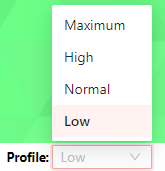

## Copas UI
Description of the UI

### Statusbar
On the left you can see status of available services present in this module. Services can be either up (green) or down (red).
When hovering over service name, further information about the service can be potentially shown.

Next to service status are available actions, which can be defined by the module. These serve to update the state of the container - e.g., delete the data of a service, restart the service or similar.

Next is profile. If profile functionality is present, there is always one active profile, which can be updated using the selection list. Profile usually serves for setting the resource consumption by the module, but can be used for other purposes.

On the right side of statusbar is the name of the container and the name of module with its version.

### File manager
File manager allows to manage files inside the container.
Currently there is support for:
- **uploading files** - either upload button or drag and drop
- **creating new directories** using new directory button
- **deleting files** - either delete button or Del key on keyboard
- **copy/cut files** functionality using Ctrl + C/X , Ctrl + V
- **searching and filtering** files using search bar

There are two view modes for contents of directories - list and grid mode.
By default hidden files (beginning with a dot) remain hidden, but they can be shown using a radio button option.

### Importing files for analysis
Importing of files is the central part of the application. 
Files need to already be uploaded to the container (perhaps via file manager) before importing them for analysis.

The process has (potentially) 4 steps:
1. **File selection** - Firstly files are selected, also directories and contents of archives can be selected. Directories can be selected for further watching which is explained further. Once the user selected all the desired files, next step comes.
2. **Choosing analysis configuration** - Configuration for analysis can be either chosen directly, a new one can be created from scratch or an existing configuration can be duplicated and modified.
3. **Create/modify a configuration** (Optional)  - Details about a particular set of options for the module are specified in respective help section.
4. **View summary and confirm import** - Summary of selected files, configuration and watched directories is displayed. If a new configuration was created or existing modified, an option to save the configuration is shown, which will happen if the import is successful.

### Watching directories for new files
Directories can be selected for watching along with an assigned configuration. A watchdog checks on this directory and its subtree and when a new file appears in the subtree given by the directory, it is automatically imported.

Watchdogs can be either created during import when selecting a directory or separately in its dedicated UI, where all the watched directories can be viewed.

### History
History of all the imports is available as well. Table displays information about the date, status of import, files imported, the origin of import (manual vs watchdog) and the configuration used.

Information can be filtered and sorted.